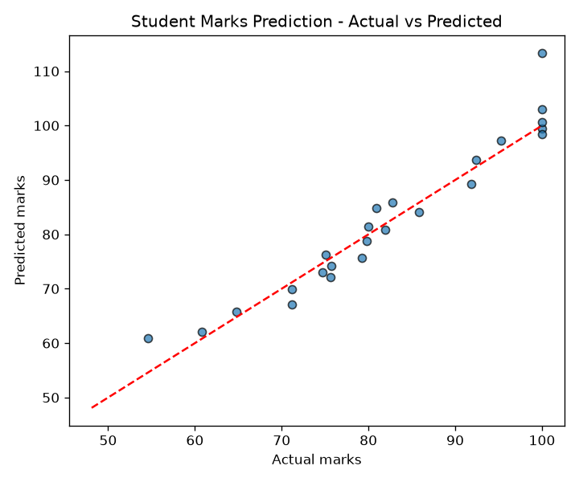

# Student Marks Prediction

A simple machine learning project that predicts a student's final marks (0–100)
from study habits and past performance, using **Linear Regression** with
scikit-learn.

## Overview

| Item | Detail |
|------|--------|
| Task | Regression (predict a continuous score) |
| Model | Linear Regression |
| Library | scikit-learn |
| Language | Python 3 |
| Input features | study hours/day, attendance %, previous exam score |

## Dataset

The project ships with a small reproducible synthetic dataset of **120 students**
(`data/student_data.csv`). It is generated by `create_dataset()` in the script
using a fixed random seed, so results are identical on every run.

| Feature | Description | Range |
|---------|-------------|-------|
| `study_hours` | Average study hours per day | 0.5 – 9.0 |
| `attendance_percent` | Class attendance (%) | 55 – 100 |
| `previous_score` | Score in the previous exam | 35 – 98 |
| `marks` | Final marks (target) | 0 – 100 |

## Results

Evaluated on a held-out 20% test split:

| Metric | Value |
|--------|-------|
| MAE (mean absolute error) | **2.59 marks** |
| RMSE (root mean squared error) | **3.69 marks** |
| R² score | **0.917** |



## How to run

```bash
# 1. Install dependencies
pip install -r requirements.txt

# 2. Run the project
python student_marks_prediction.py
```

The script loads the dataset (creating it if missing), trains the model,
prints the evaluation metrics and learned coefficients, predicts marks for a
sample student, and saves the actual-vs-predicted plot to `plots/`.

## Project structure

```
student-marks-prediction/
├── student_marks_prediction.py   # data generation, training, evaluation
├── data/
│   └── student_data.csv          # 120-row dataset
├── plots/
│   └── actual_vs_predicted.png   # model output plot
├── requirements.txt
└── README.md
```

## Notes

The dataset is synthetic and created for learning and demonstration purposes.
The same workflow applies to a real dataset by replacing `data/student_data.csv`
with actual student records.
